# 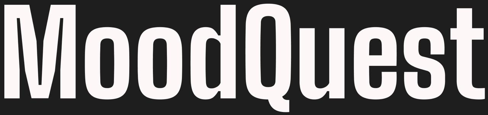

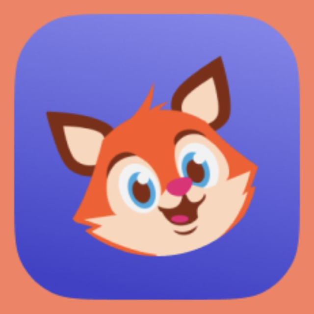

## MoodQuest: A Gamified Mental Health App

### Overview
MoodQuest is a mobile application designed to help users improve their mental well-being through gamification. Our aim is to increase user retention by making mental health management engaging and enjoyable.

### Features
- **Mood Tracking**: Log your daily moods and activities.
- **Quests and Challenges**: Participate in quests that promote positive mental health habits.
- **Progress Visualization**: View your progress and mood trends over time.
- **Community Support**: Connect with others on similar quests.

### Development Process
Our development process involved several key stages, from ideation to final implementation. Here are some highlights:

#### Ideation and Planning


#### Design and Prototyping


#### Development


#### Testing


#### Deployment


### App Screenshots
Take a look at some screenshots of the MoodQuest app in action:

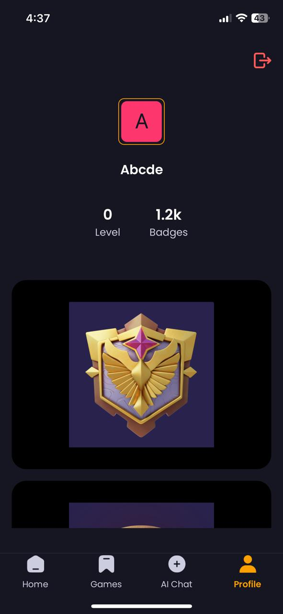
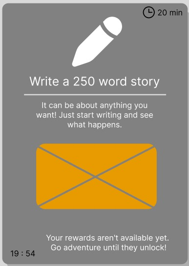
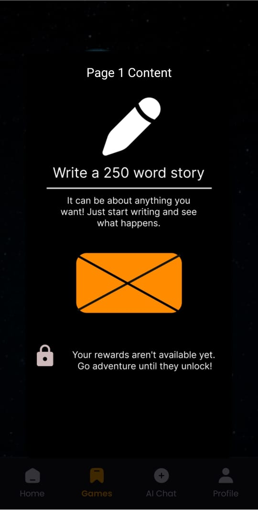
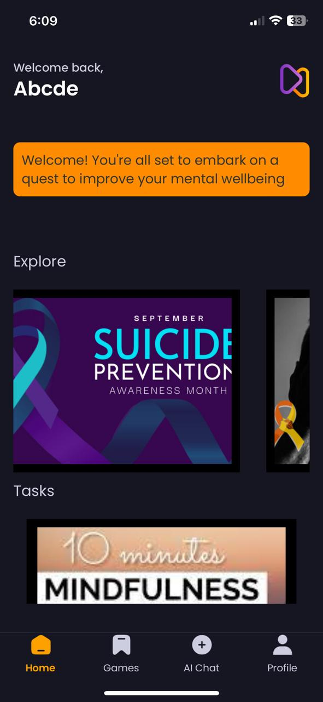
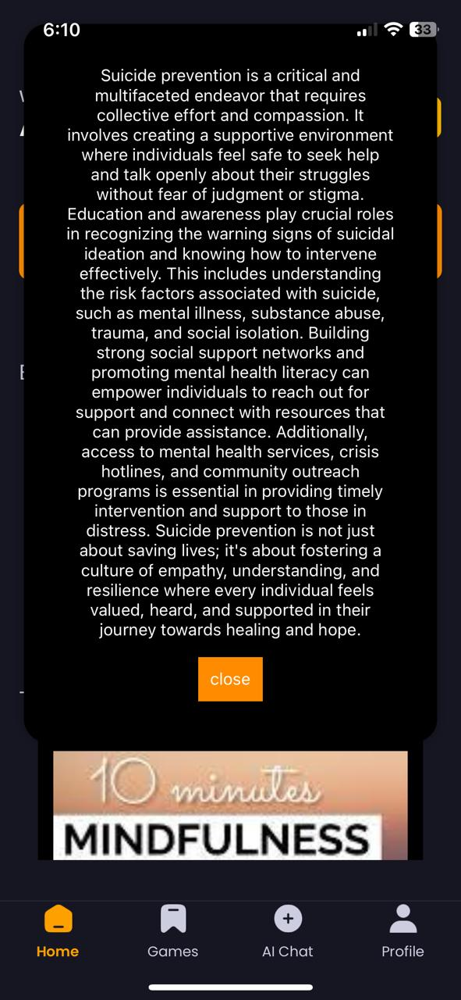
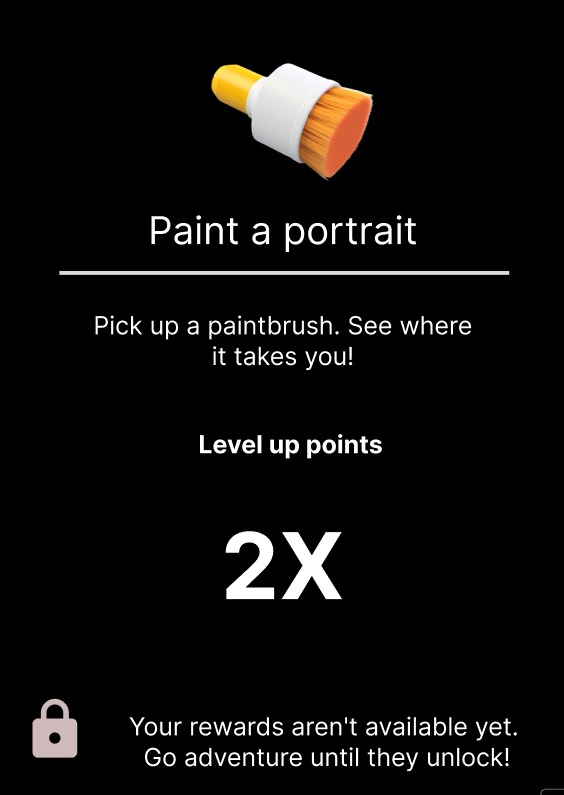
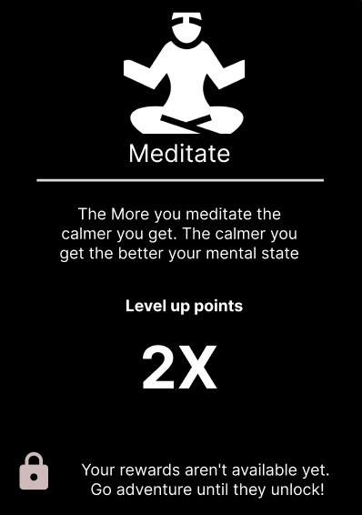
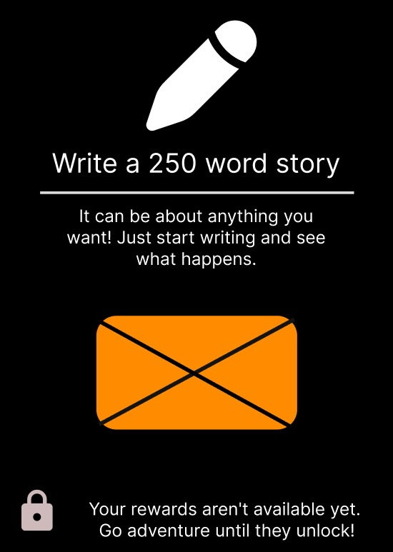
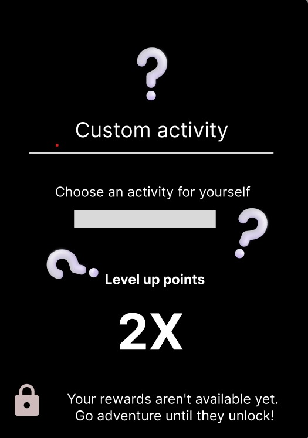

### Installation
To install and run MoodQuest on your local machine, follow these steps:

1. **Clone the repository**
   ```bash
   git clone https://github.com/theshamiksinha/MoodQuest.git
