# 


## MoodQuest: A Gamified Mental Health App

### Overview
MoodQuest is a mobile application designed to help users improve their mental well-being through gamification. Our aim is to increase user retention by making mental health management engaging and enjoyable.

### Features
- **Mood Tracking**: Log your daily moods and activities.
- **Quests and Challenges**: Participate in quests that promote positive mental health habits.
- **Progress Visualization**: View your progress and mood trends over time.
- **Community Support**: Connect with others on similar quests.

### Development Process
Our development process involved several key stages, from ideation to final implementation. Here are some highlights:

#### Ideation and Planning
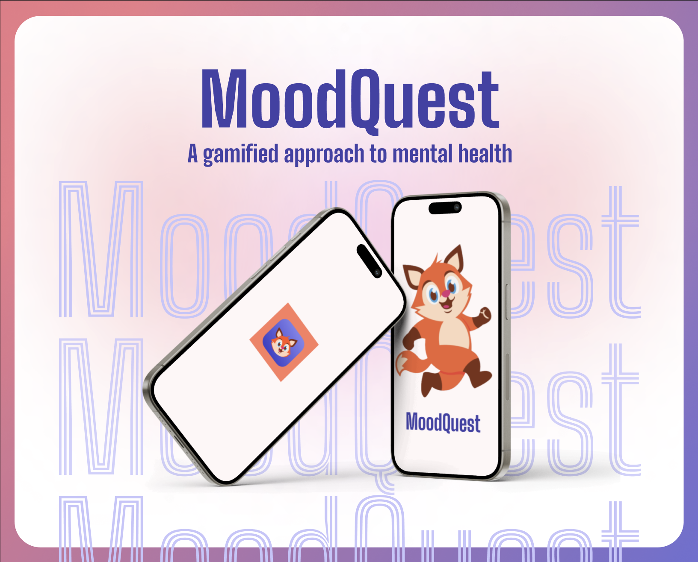

#### Design and Prototyping
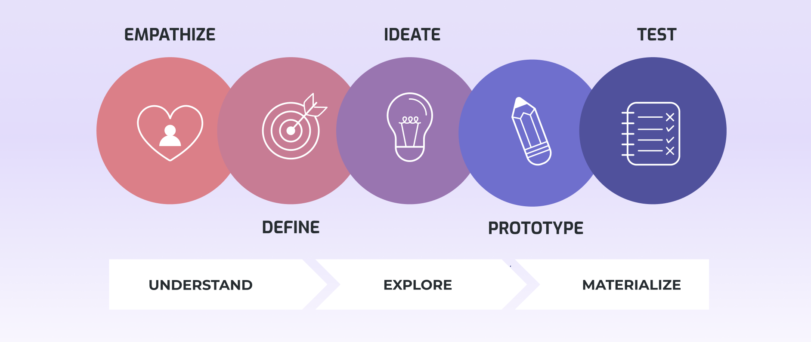

#### Development
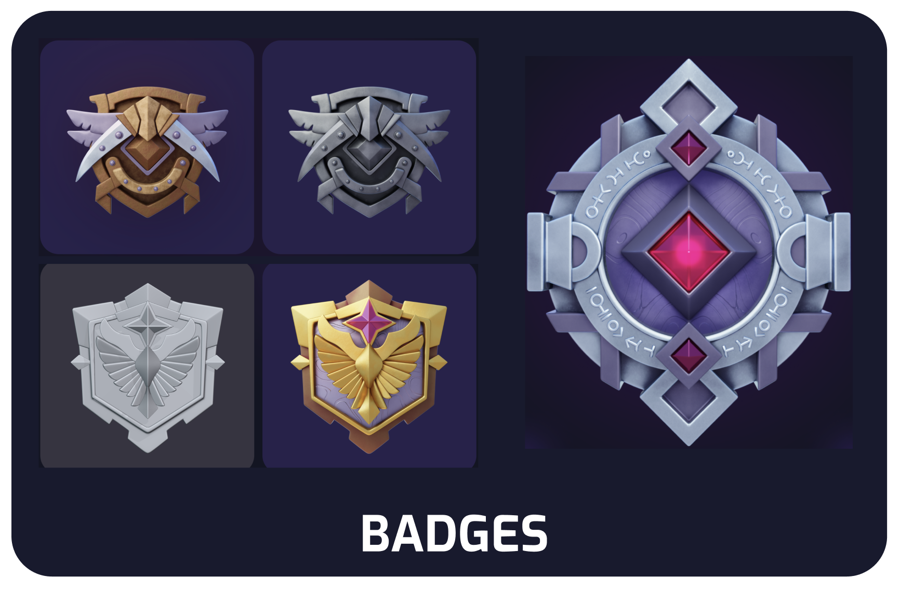

#### Testing
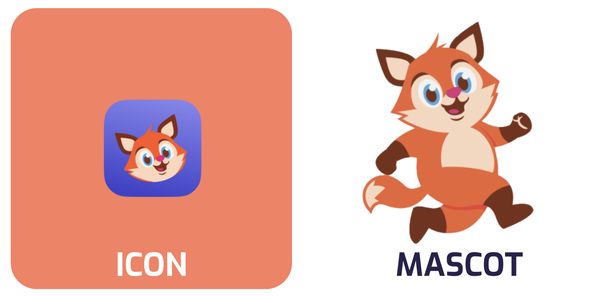

#### Deployment
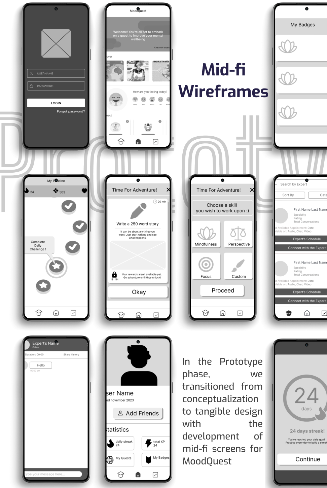


### App Screenshots
Take a look at some screenshots of the MoodQuest app in action:

| 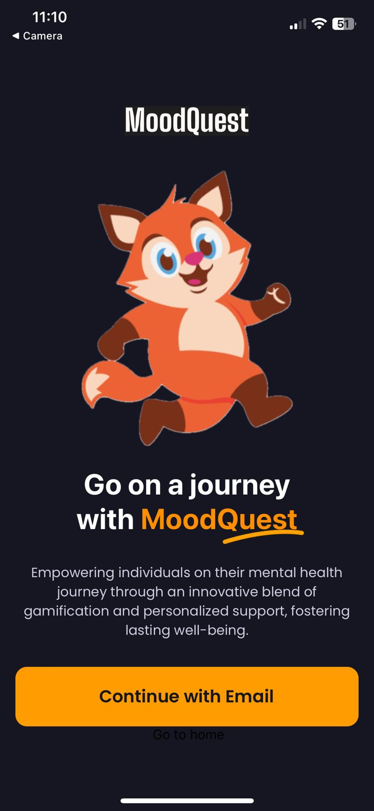 | 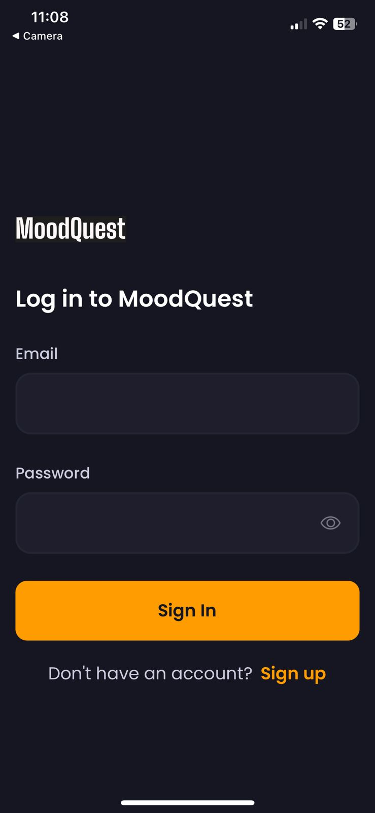 | 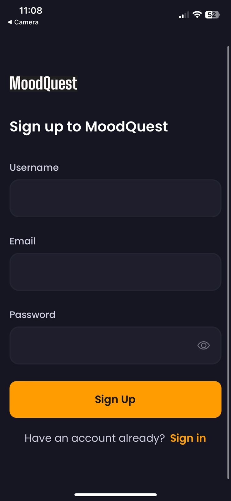 |
|---------------------------------------------------------------|----------------------------------------------------------------|----------------------------------------------------------------|
| *Onboarding page of MoodQuest*                                | *Login Page*                                                   | *Sign Up page*                                                 |

| 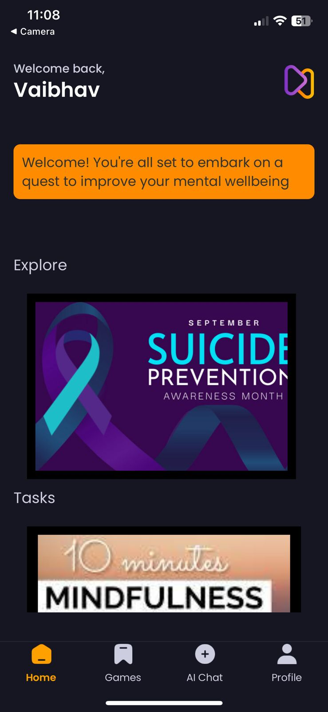 |  |  |
|----------------------------------------------------------------|----------------------------------------------------------------|----------------------------------------------------------------|
| *Home page*                                                    | *Read blogs and articles*                                      | *Daily Checkpoints for tasks*                                  |

| 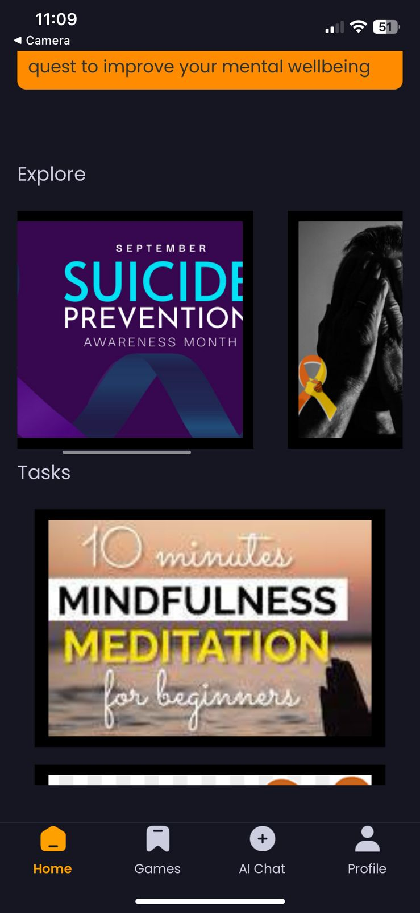 | 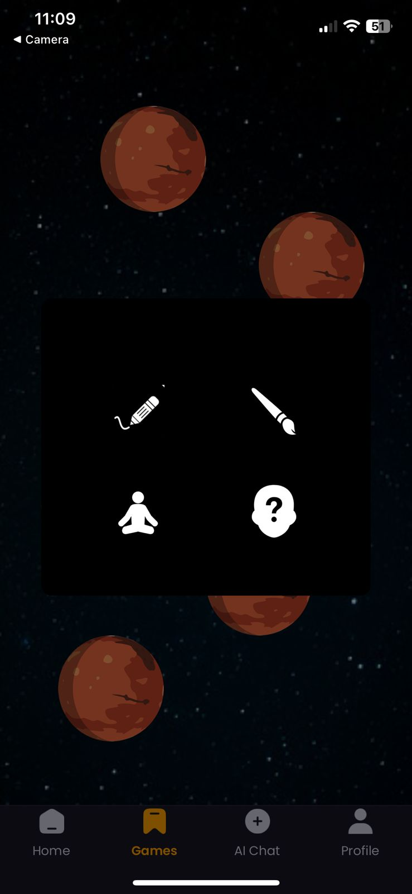 |  |
|----------------------------------------------------------------|----------------------------------------------------------------|----------------------------------------------------------------|
| *Daily tasks and other features*                               | *Choose your activity*                                         | *Different Activities*                                        |

|  | 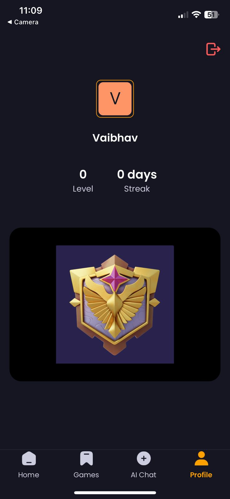 |  |
|----------------------------------------------------------------|----------------------------------------------------------------|----------------------------------------------------------------|
| *Daily Checkpoints for tasks*                                  | *Profile and Badges earned*                                    | *Different Activities*                                        |

|  |  | 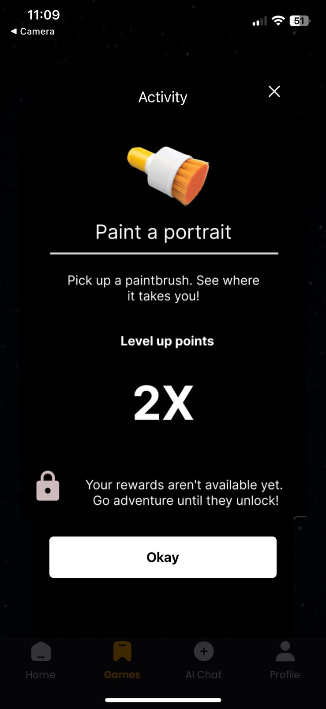 |
|----------------------------------------------------------------|----------------------------------------------------------------|----------------------------------------------------------------|
| *Different Activities*                                        | *Different Activities*                                        | *Explore Tasks*                                                |

| 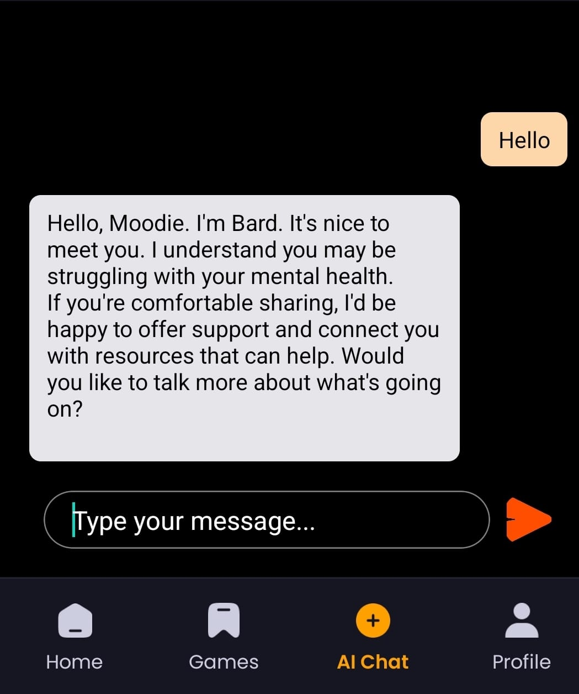 |
|----------------------------------------------------------------|
| *AI chatbot using Gemini*                                      |


### Installation
To install and run MoodQuest on your local machine, follow these steps:

1. **Clone the repository**
   ```bash
   git clone https://github.com/theshamiksinha/MoodQuest.git
