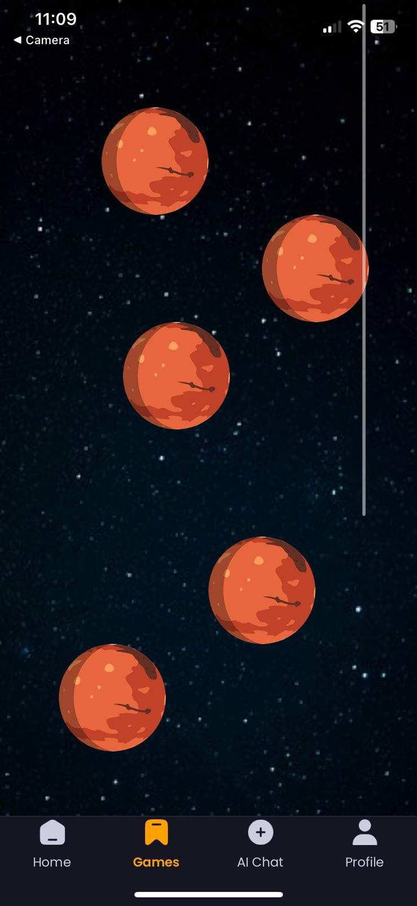

<div style="display: flex; align-items: center;">
  
  <span style="font-size: 48px; font-weight: bold;">.   .   .</span>
  
  <span style="font-size: 48px; font-weight: bold;">.   .   .</span>
</div>

# 👾 MoodQuest: A Gamified Mental Health App 🦊

---

## Overview
MoodQuest is a mobile application designed to help users improve their mental well-being through gamification. Our aim is to increase user retention by making mental health management engaging and enjoyable.

---

## Features
- **Mood Tracking**: Log your daily moods and activities.
- **Quests and Challenges**: Participate in quests that promote positive mental health habits.
- **Progress Visualization**: View your progress and mood trends over time.
- **Community Support**: Connect with others on similar quests.

---

## Development Process
Our development process involved several key stages, from ideation to final implementation. Here are some highlights:

| | |
| --- | --- |
| ### MoodQuest | ### Design Philosophy |
|  |  |

| | |
| --- | --- |
| ### Gamified Elements | ### Prototyping |
|  |  |

---

## App Screenshots
Take a look at some screenshots of the MoodQuest app in action:

|  |  |  |
| --- | --- | --- |
| *Onboarding page of MoodQuest* | *Login Page* | *Sign Up page* |

|  |  |  |
| --- | --- | --- |
| *Home page* | *Read blogs and articles* | *AI chatBot using Gemini* |

|  |  |  |
| --- | --- | --- |
| *Daily tasks and other features* | *Choose your activity* | *Different Activities* |

|  |  |  |
| --- | --- | --- |
| *Daily Checkpoints for tasks* | *Profile and Badges earned* | *Different Activities* |

|  |  |  |
| --- | --- | --- |
| *Different Activities* | *Different Activities* | *Explore Tasks* |

---

## Installation
To install and run MoodQuest on your local machine, follow these steps:

1. **Clone the repository**
   ```bash
   git clone https://github.com/theshamiksinha/MoodQuest.git

   MoodQuest: Installation, Configuration, and Access
Markdown
# Prerequisites

* Node.js and npm (or yarn) installed on your system.
* A MySQL database server installed and running.
* Expo Go app installed on your iOS or Android device (for mobile access).

# Installation and Setup

1. **Install Dependencies:**
bash
npm install

2. Run Backend Server:
bash
Copy code
npm start

3. Deploy Mobile App using Expo Go:

Download and install the Expo Go app on your mobile device.

Start the Expo development server:

bash
Copy code
npm run start
Scan the QR code displayed in the terminal using the Expo Go app to launch MoodQuest on your mobile device.


## Tech Stack

MoodQuest utilizes a modern tech stack to ensure robust performance and scalability. Here are the key technologies and frameworks employed in the development:

- **Frontend**:
  - **React Native**: For building the cross-platform mobile application.
  - **Redux**: For managing application state and data flow.
  - **NativeWind CSS**: For styling components in a consistent and responsive manner.

- **Backend**:
  - **Node.js**: For server-side scripting and handling backend logic.
  - **Express.js**: As the web application framework for Node.js.
  - **MySQL**: For the relational database management system, storing user data and application information.

- **AI and Machine Learning**:
  - **Google Cloud Vertex AI**: For implementing AI-driven features like the chatbot using Gemini models.

- **Deployment and Version Control**:
  - **Expo Go**: For deploying the mobile application to iOS and Android devices during development and testing phases.
  - **GitHub**: For version control and collaboration among team members.
  - **PythonAnywhere**: For hosting and deploying the backend server and MySQL database.

- **Other Tools and Technologies**:
  - **Adobe Illustrator**: For designing UI elements and graphics.
  - **Vertx AI Gemini**: For developing and integrating AI chatbot functionalities.

This tech stack was chosen to ensure a seamless user experience, efficient data management, and the integration of advanced AI capabilities to enhance the app's functionality.

